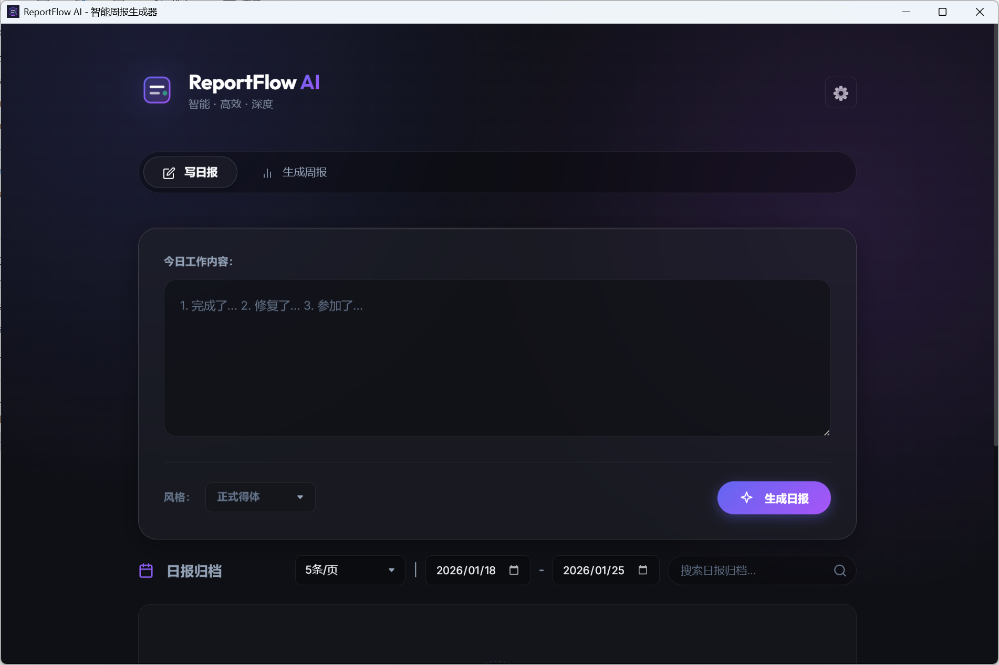

# 🚀 ReportFlow AI

一个基于 AI 的智能日报/周报生成器，支持 Windows 和 macOS 桌面版。



## ✨ 核心特性

- **深度思考模式 (Thinking Mode)**  
  支持 DeepSeek R1 等推理模型，展示完整的思维链 (Chain of Thought)，让生成过程透明可信。

- **多模型支持**  
  原生支持 DeepSeek、OpenAI、SiliconFlow，并兼容 Ollama 本地模型，满足不同场景需求。

- **智能日报/周报**  
  仅需输入简要工作事项，即可生成结构清晰的日报；支持一键汇总本周记录生成的周报。

- **本地优先 (Local-First)**  
  数据完全存储在本地（JSON 格式），路径可自定义。保障隐私安全，无需担心数据泄露。

- **现代化界面**  
  精心打磨的深色极光主题，专注于写作体验，支持 Windows 与 macOS 双平台。

## 📦 安装与使用

### 方式一：下载安装包（推荐）

前往 [Releases](https://github.com/Dxboy266/ai-report-generator/releases) 页面：
- **Windows 用户**：下载 `.exe` 安装包
- **macOS 用户**：下载 `.dmg` 安装包

双击安装，开箱即用。

### 方式二：从源码构建

#### 前置条件
- Node.js 16+ 
- npm 或 yarn

#### 步骤

1. **克隆项目**
   ```bash
   git clone https://github.com/Dxboy266/ai-report-generator.git
   cd ai-report-generator
   ```

2. **安装依赖**
   ```bash
   npm install
   ```

3. **配置 API**
   
   启动应用后，点击右上角设置图标，填入您的 AI 服务商 API Key：
   - DeepSeek API：https://platform.deepseek.com
   - 或其他 OpenAI 兼容接口

4. **运行开发模式**
   ```bash
   # 网页模式（开发调试）
   npm start
   
   # 桌面应用模式（Electron）
   npm run app
   ```

5. **打包为安装包**
   ```bash
   npm run dist
   ```
   
   打包后的文件在 `dist/` 目录：
   - Windows：`.exe` 安装程序
   - macOS：`.dmg` 安装镜像

## 🎯 使用指南

### 1. 生成日报

在"写日报"标签页中：
1. 输入今日工作内容（可以是流水账形式）
2. 选择报告风格（正式得体 / 轻松自然 / 硬核技术）
3. 点击"生成日报"
4. AI 自动整理为规范日报，可直接复制粘贴

### 2. 生成周报

在"生成周报"标签页中：
1. 系统自动读取本周已保存的日报
2. 点击"生成周报"，AI 基于本周工作自动汇总
3. 一键保存或复制

### 3. 数据管理

- **查看历史**：日报归档 / 周报归档标签页，支持日期筛选和关键词搜索
- **更改存储位置**（桌面版）：
  1. 打开设置
  2. 在"数据存储位置"点击"更改目录"
  3. 选择您想要的文件夹（如 `D:\我的工作日报`）
  4. 重启生效

## 🛠️ 技术架构

- **前端**：原生 HTML/CSS/JavaScript，杂志级 UI 设计
- **后端**：Express.js (Node.js)
- **桌面框架**：Electron
- **AI 集成**：支持 OpenAI 兼容 API (DeepSeek / GPT / 本地 Ollama)
- **数据存储**：本地 JSON 文件（支持自定义路径）

## 🔧 配置说明

### 支持的 AI 提供商

| 提供商 | Base URL | 推荐模型 |
|--------|----------|---------|
| DeepSeek | `https://api.deepseek.com/v1` | `deepseek-chat` |
| SiliconFlow | `https://api.siliconflow.cn/v1` | `deepseek-ai/DeepSeek-V3` |
| OpenAI | `https://api.openai.com/v1` | `gpt-4o` |
| 本地 Ollama | `http://localhost:11434/v1` | `llama3` |

### 自定义配置文件

桌面版配置文件位置：
- **Windows**: `C:\Users\<用户名>\AppData\Roaming\ReportFlowAI\config.json`
- **macOS**: `~/Library/Application Support/ReportFlowAI/config.json`

## 📝 开发指南

### 项目结构

```
ai-report-generator/
├── main.js                 # Electron 主进程入口
├── server.js               # Express 服务器入口
├── public/                 # 前端资源
│   ├── index.html
│   ├── css/
│   └── js/
├── server/                 # 后端逻辑
│   ├── routes/            # API 路由
│   ├── services/          # AI 服务
│   ├── prompts/           # Prompt 模板
│   └── utils/             # 工具函数
└── data/                   # 用户数据（不提交 Git）
```

### 贡献指南

欢迎提交 Pull Request！

1. Fork 本仓库
2. 创建特性分支 (`git checkout -b feature/AmazingFeature`)
3. 提交更改 (`git commit -m 'Add some AmazingFeature'`)
4. 推送到分支 (`git push origin feature/AmazingFeature`)
5. 发起 Pull Request

## 📄 开源协议

本项目基于 [MIT License](LICENSE) 开源。

## 🙏 致谢

- AI 模型支持：DeepSeek
- Markdown 渲染：marked.js
- 桌面框架：Electron

---

**如果觉得有用，请给个 ⭐ Star，感谢支持！**
