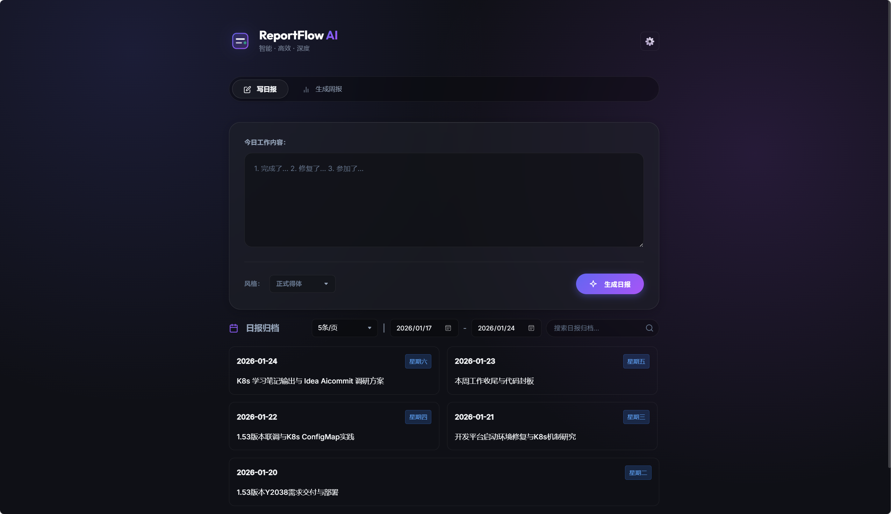

<div align="center">

# 🚀 ReportFlow AI
### 全能型 AI 智能工作汇报助手
### Your Ultimate Intelligent Work Reporting Assistant

[](https://nodejs.org/)
[](https://github.com/)
[](https://github.com/)
[](LICENSE)

</div>

---

## 💡 简介 (Introduction)

**ReportFlow AI** 是一款**面向所有人**的智能工作汇报神器。无论你是职场白领、自由职业者、学生还是团队管理者，它都是你职业生涯的最佳记录者。

**ReportFlow 重新定义了汇报**。不止于日报周报，更是你职业生涯的全周期智能助手。未来，无论是月度总结、季度回顾，还是年终述职，ReportFlow 都能帮你运筹帷幄。告别“汇报焦虑症”，让 AI 将你碎片化的日常努力，瞬间转化为逻辑清晰、价值突出的完美报告。

## 🔥 核心功能展示

### 1. ✍️ 极速记录，可视化归档
**日报模式**：极简的录入体验，配合自适应的智能网格历史布局，让每一天的工作都井井有条，不再遗漏任何重要细节。
> 

### 2. 🪄 AI 魔法，一键成文
**周报模式**：基于多模型 AI (DeepSeek, GPT, Claude 等)，自动将一周的流水账转化为高质量的汇报文档。支持多种文风切换（正式/简洁/专业），一键生成，效率翻倍。
> 

## 🚀 快速开始 (Quick Start)

只需要 Node.js 环境即可运行：

1.  **下载代码**
    ```bash
    git clone https://github.com/yourusername/reportflow-ai.git
    cd reportflow-ai
    ```

2.  **安装依赖**
    ```bash
    npm install
    ```

3.  **启动应用**
    ```bash
    npm start
    ```
    在浏览器打开 `http://localhost:3000` 即可使用。

## ⚙️ 配置说明

*   **端口修改**：默认运行在 3000 端口，可在 `server.js` 中修改。
*   **AI 配置**：目前支持 DeepSeek 等模型，请在 `server.js` 中配置您的 API Key。
*   **数据存储**：所有数据默认保存在本地 `data/` 目录下，无需配置数据库，迁移方便，隐私安全。

## 🤝 贡献 (Contributing)

欢迎提交 Issue 或 Pull Request！无论是新功能建议还是 Bug 修复，我们都非常期待您的参与。

## 📄 开源协议 (License)

MIT © 2026 ReportFlow AI Team
